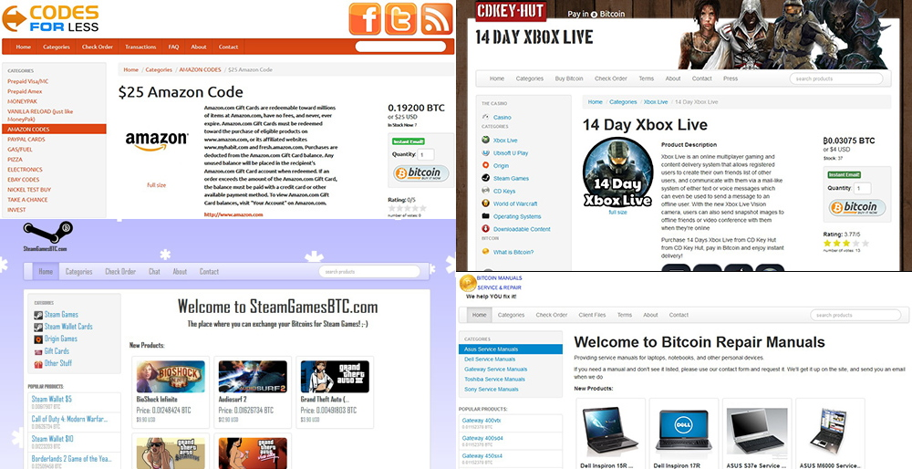

# BitShop

BitShop is a PHP/MYSQL shopping cart script which allows merchants to easily sell digital items such as software or codes in return for bitcoin and other cryptocurrencies.

BitShop uses multiple public block explorer API's to confirm payments in the built-in payment gateway. Addresses can be automatically generated on the fly or taken from a custom list. 

BitShop supports multiple payment gateways, including Coinbase, GoCoin, and the built-in gateway, which can all be enabled simultaneously. Now also includes support for PayPal.

You can also run a bitcoin/altcoin daemon to directly process payments without a 3rd party. BitShop includes an administration area where you can manage all your settings.

BitShop supports a wide range of different methods for selling digital items but also includes some basic support for selling physical items with shipping costs.

This was a commercial script but the code base is getting slightly outdated and I don't have much time to work on it anymore so I decided to make it open source. Enjoy.

## Resources
Website: [bitfreak.info/bitshop/](https://bitfreak.info/bitshop/)  
Forum: [bitfreak.info/forum/](https://bitfreak.info/forum/)

## Requirements

- PHP 5 or greater
- MySQL 5 or greater
- BCMATH

## Installing

Follow this simple process to install BitShop:

1. Upload BitShop files to your server.
2. Visit www.yoursite.com/install/install.php
3. Delete the install folder when finished.

## Updating

Check which files have changed in the new version of BitShop and replace your old files with the updated files. Then re-apply any customizations you made to the new files.